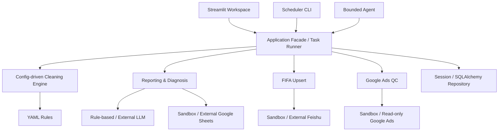

# Marketing Ops AI Agent

Advertising data automation, daily reporting, FIFA synchronization and Google Ads quality control in one Streamlit operations workspace.

> **Public Sandbox:** the hosted workspace uses anonymized sample data and contains no customer records. Every metric, anomaly, synchronization result and QC finding is calculated by the application at runtime.

## Product Overview

Marketing operations teams routinely combine platform exports, spreadsheet-based plans and multiple external systems. The resulting workflows are slow to audit and prone to formula, duplication and launch-configuration errors.

This platform consolidates four operational workflows:

1. Clean and validate FB, TikTok and Google performance exports.
2. Calculate daily KPI, budget pacing, audience and creative performance.
3. Synchronize revised FIFA source files with deterministic Insert/Update/Skip behavior.
4. Compare Media Plans with read-only Google Ads records before launch.

Python owns all calculations and QC decisions. The language-model layer only explains precomputed facts and can never change Google Ads settings.

## Architecture



The UI, CLI and Agent call the same application services. Calculation, cleaning and QC logic remain independent of Streamlit and are covered by automated tests.

## Core Capabilities

- **Overview:** operational Clean → Report → Sync → QC workflow.
- **Data Cleaning:** target-sheet detection, early project/date filtering, YAML rules, validation, audit log and Excel export.
- **Daily Report:** Python-calculated KPI, pacing, trends, platform, audience and creative analysis.
- **AI Diagnosis:** fact-grounded explanations with explicit human-confirmation boundaries.
- **FIFA Sync:** target-schema cleaning, deterministic business keys and idempotent Upsert.
- **Google Ads QC:** dynamic Sheet/Header detection, confirmed schema mapping, naming parsers and strict canonical comparison.
- **Agent Chat:** transparent intent routing through an allow-listed tool registry.
- **Task History:** RUNNING/SUCCESS/WARNING/FAILED execution history.
- **Settings:** session-scoped project dates, budgets, Sheet IDs and thresholds.

## Technology Stack

- Python 3.11+
- Streamlit and Plotly
- Pandas and OpenPyXL
- Pydantic and YAML configuration
- SQLAlchemy and SQLite
- Pytest and Streamlit AppTest
- Google Sheets API, Feishu Open API and read-only Google Ads API adapters
- Optional OpenAI Responses API integration with deterministic fallback

## Repository Structure

```text
app.py                  Overview entry point
pages/                  Seven workflow pages
src/application/        Shared application facade and task runner
src/etl/                Workbook inspection and cleaning engine
src/reporting/          KPI, pacing, analysis and diagnosis
src/fifa/               File scanning, cleaning and idempotent synchronization
src/qc/                 Mapping, parsing, matching and validators
src/connectors/         Sandbox and external-system adapters
src/storage/            Session and SQLAlchemy repositories
config/                 Projects, cleaning, anomaly and QC rules
data/sample/            Anonymized sample workspace
tests/                  Unit, safety, integration and UI tests
```

## Run Locally

### Windows PowerShell

```powershell
py -3.11 -m venv .venv
.\.venv\Scripts\Activate.ps1
python -m pip install -r requirements.txt
python -m scripts.initialize_sample_data
streamlit run app.py
```

Open `http://localhost:8501`.

### Tests

```powershell
pytest -q
```

### Scheduler-compatible commands

```powershell
python -m scripts.run_daily_report --demo --country UG --date 2026-08-26
python -m scripts.run_fifa_sync --demo --date 2026-08-26
```

The `--demo` CLI flag selects the repository's isolated Public Sandbox dataset; it does not bypass business validation or use hard-coded report results.

## External Integrations

The Public Sandbox works without credentials. Authorized environments can configure:

- Google Sheets service account
- Feishu Bitable application
- Read-only Google Ads API client
- OpenAI API for fact-grounded language summaries

Environment variable names are documented in `.env.example`. Credentials are loaded only at runtime and must never be committed.

## Security Boundaries

- No customer or former-employer data is included.
- Sample Excel and JSON files are generated deterministically from anonymized business-shaped records.
- `.env`, databases, service-account files, local outputs and caches are excluded from Git.
- Google Ads external access is read-only by interface design.
- The Agent has no Enable, Pause, Budget, Bid, Audience, Creative or Delete tool.
- Variable Media Plan mappings require explicit human confirmation before QC.

## Deployment

The application is compatible with Streamlit Community Cloud and Docker-based platforms.

For Streamlit Community Cloud, select the public repository, `main` branch and `app.py`. No secrets are required for the Public Sandbox.

For Docker:

```powershell
docker build -t marketing-ops-ai-agent .
docker run --rm -p 8501:8501 marketing-ops-ai-agent
```

## Current Scope

- QC validators currently cover GDN, VRC and VVC.
- Public state is isolated per Streamlit browser session.
- External API verification requires credentials issued by the relevant account owner.
- Streamlit is suitable for this operations workspace; a higher-concurrency multi-tenant deployment would move application services behind an API and persistent job infrastructure.

## Documentation

- [Architecture for non-technical readers](docs/ARCHITECTURE_CN.md)
- [Chinese runbook](docs/RUNBOOK_CN.md)
- [Data dictionary](docs/DATA_DICTIONARY_CN.md)

