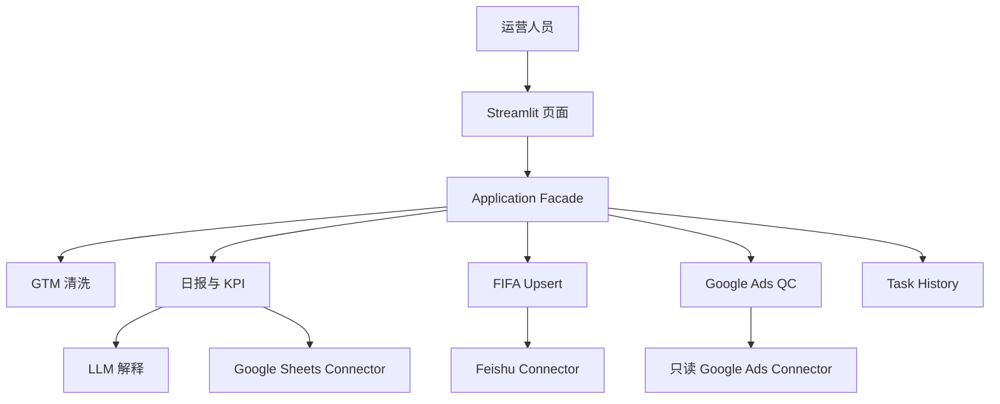

# 架构说明（非技术人员版）

## 1. 这个系统在做什么

Marketing Ops AI Agent 把广告运营中四类工作放在一个中台：数据清洗、日报分析、FIFA 数据同步、Google Ads 上线前 QC。页面只是操作入口，真正的计算和判断都在 Python 服务中完成。



## 2. 常见术语

### API 是什么

API 可以理解为两个系统之间约定好的“服务窗口”。本项目不需要模拟人在网页上点按钮，而是通过 Google、Feishu 等平台提供的正式窗口读取或写入数据。API 通常比 RPA 更稳定，也更容易记录错误和权限。

### ETL 是什么

ETL 是 Extract、Transform、Load：先读取数据，再清洗转换，最后交给报表或目标系统。GTM 和 FIFA 都使用 ETL，但规则和输出不同。

### Schema 是什么

Schema 是数据的字段说明书。例如 FIFA 规定必须有 Country、Date、Platform、Spend 等列。Schema 让程序知道一列代表什么、应该是什么类型。

### Canonical Data Model 是什么

不同平台可能把同一含义写成不同名称。Canonical Model 是系统内部的统一语言。例如 `$5,000`、`5000`、`5000.00` 进入比较前都变成数字 `5000.0`。只有先统一，严格比较才不会误报。

### Rule Engine 是什么

Rule Engine 是按明确规则执行判断的程序。本项目把清洗规则和阈值放在 YAML 中，而不是散落在页面代码中。修改阈值时不需要重写所有逻辑。

### Connector 是什么

Connector 是连接外部系统的适配层。业务服务只说“写日报”或“读取广告”，不关心背后是 Sandbox 数据源还是已授权的外部 API。

### Adapter Pattern 是什么

Adapter Pattern 就像电源转接头：设备使用相同插口，转接头负责适配不同标准。Sandbox 和 External Connector 对系统提供相同接口，因此业务服务不需要因运行环境变化而重写。

### Idempotency 是什么

Idempotency（幂等性）表示同一个任务执行多次，不会产生重复副作用。例如同一天日报再次运行会替换 Worksheet，而不是再建一个；同一 FIFA 文件再次同步只会 Skip。

### Upsert 是什么

Upsert = Update + Insert。目标记录不存在就 Insert，已存在但内容变化就 Update，完全相同就 Skip。它比简单 Append 更安全。

### Human-in-the-loop 是什么

Human-in-the-loop 表示 AI 或规则给出建议后，人必须确认关键步骤。Media Plan 列名不固定，系统先建议 Schema Mapping，但用户必须点击 Confirm Mapping，之后才能运行 QC。

## 3. 为什么 Python 和 LLM 要分工

Python 负责：

- 加减乘除与 KPI
- 日期和 Budget Pacing
- 数据清洗、去重和 Upsert
- 字段比较和 PASS/WARNING/ERROR
- 幂等性和任务状态

LLM 负责：

- 把结构化异常解释成人能理解的话
- 根据少量表头建议 Schema Mapping
- 理解聊天意图
- 总结已计算事实并提出建议

如果让 LLM 直接计算 KPI，同一输入可能得到不一致答案，也难以审计。Python 公式可以被测试、复现和逐行检查，因此数字必须由 Python 计算。

## 4. 为什么 Sandbox 和 External Connector 分开

公开环境不能依赖客户账号，也不能暴露客户数据。Sandbox Connector 使用固定 Seed 的匿名化样例数据，使工作流可重复验证。External Connector 保留标准 API 接口，在取得合法权限后不需要重写业务规则。

## 5. 四个核心数据流

### GTM Cleaning

```text
Excel → 识别 FB/TT/第一个 GG → 项目/日期早过滤 → YAML 清洗规则
→ Validation → Canonical Data → Audit Log
```

### Daily Report

```text
Clean Data → Python KPI → Audience/Creative 聚合 → 7日与预算诊断事实
→ Rule-based/External LLM 总结 → Dashboard / Google Sheet
```

### FIFA Sync

```text
Shared Drive File → Target Schema → Cleaning → Business Key
→ Insert / Update / Skip → Sandbox/External Feishu
```

### Google Ads QC

```text
Media Plan → Sheet/Header 检测 → Schema Mapping → 人工确认
→ Canonical QC Model ← 只读 Google Ads
→ Strict Comparator → PASS / WARNING / ERROR
```

## 6. Public Sandbox 与 External Integration 状态

Public Sandbox 使用 Streamlit Session State。每位访客有自己的任务、Sandbox Sheet 和 Sandbox Bitable，Reset Workspace 只清理当前访客。

持久化环境使用 SQLAlchemy + SQLite，并可把 `DATABASE_PATH` 指向持久卷。Google Ads External Connector 只提供读取方法，Agent 和页面都没有广告写工具。

## 7. 为什么选择 Streamlit

Streamlit 能用纯 Python 构建数据表、图表、上传、下载和运营工作流。它让业务逻辑与 UI 使用同一种语言。其高并发、多租户和复杂交互能力不如专业前后端框架，因此未来大规模部署可以把 Application Service 迁移到 FastAPI。
